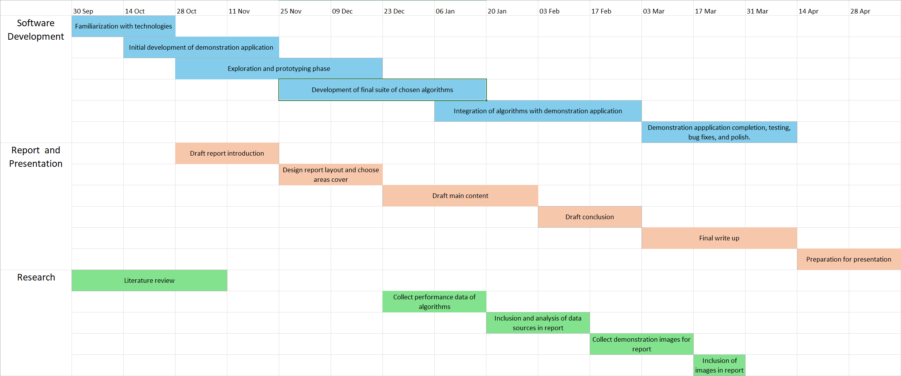

# Project summary/overview
The goal of the project is to explore, extend and reimagine the usage of L-Systems within the field of procedural content generation in 3D video games. Examples of areas that could be explored are:
- Environmental Assets
- Objectives / Quests
- Gameplay Mechanics
- Dialogue
- Item Assets
- Textures
- Particle and Shader Effects
- Architectural Assets
- Game Actors

## Functional requirements:
- A comprehensive review of the current literature must be performed to identify areas of greater and lesser exploration.
- Solutions to relatively unexplored problems must be proposed and developed.
- Solutions to well-known problems using other techniques must be developed using L-Systems.
- Experimentation must be performed to produce performance metrics of both the new solutions and existing counterparts.
- Created solutions must be critically analysed against existing solutions where appropriate.
- A 3D application must be created to demonstrate the created solutions.

## Non-functional requirements:
- Existing solutions using other techniques must be acquired or developed to perform performance measurements upon.
- An interface must be created to allow the tweaking of parameters within created solutions for demonstration purposes.
- The performance of created solutions must be reasonable for their intended use-cases which could be anywhere from real-time to offline depending on the specific solution.

## Justification:
Lindenmayer Systems are parallel self-rewriting string generation algorithms at heart and were first proposed as a way of modelling the development of plant like structures by Aristid Lindenmayer in 1968 with later work expanding on this and importantly introducing the concept of a turtle renderer to produce rendered images, culminating in a fascinating book: The Algorithmic Beauty of Plants (Prusinkiewicz & Lindenmayer, 1990).
Procedural generation in video games allows the fast creation of large amounts of content with smaller development teams which is important as over time “the most popular commercial games get larger, prettier, more atmospheric, and more detailed” (Hendrikx, Meijer, Veldon, & Iosup, 2013, p. 2) thus, requiring increasingly higher quality content which is a challenge when “manual content production is already expensive and unscalable” (Hendrikx, Meijer, Veldon, & Iosup, 2013, p. 2).
Lindenmayer systems have seen limited use in games, mostly being used “for botanic modelling and generation” (Fornander, 2013, p. 8) with some famous examples of games that use SpeedTree being: Battlefield 3, The Witcher 2, Gears of War 3 (Fornander, 2013, p. 8), Elden Ring and Ghostwire: Tokyo (SpeedTree - Wikipedia, 2024), however, their usage has been fairly limited in other areas such as game mechanics, item generation and graphical effects, and finding solutions in these under-explored areas could prove valuable if they improve current methods in an established area or if they open up an area that hasn’t been extensively investigated.

# Previous work
Extensive literature exists for solutions that use L-Systems to produce plants and trees. The Algorithmic Beauty of Plants (Prusinkiewicz & Lindenmayer, 1990) introduces the concept of L-Systems as a parallel string rewriting algorithm, presenting many examples of how they can be used with the combination of a turtle renderer to produce beautiful visuals of plants and trees. Further it introduces multiple types of L-System including parametric L-Systems where parameters or variables can be associated with the symbols within the string being operated on and thus arithmetic operations can be performed upon these values in rewriting rules, and stochastic L-Systems where a symbol is added to the alphabet to represent a random value which can be used to add variation to generated plants. Another paper uses genetic algorithms alongside L-Systems to produce plants for use in games. The initial parameters for each L-System are generated and then the L-Systems are allowed to develop with a user defined fitness function being used to determine which plants will pass their genome on to the next generation. This continues until a user-defined number of generations is simulated (Fitch, Parslow, & Lundqvist , 2018). Other papers have implemented skeletal-like animation of 2D L-Systems which can produce animations to mimic gravity, wind and other physically-driven effects (Hampshire, 2009), and the semantic death of plants using L-Systems by assigning a parameter to each symbol that tracks age and defining a maximum age which, when symbols reach they are replaced with symbols that represent a dead part of the plant with its own parameter that causes the part to slowly wilt and die (Castellanos, Ramos, & Ramos, 2014).
Plant generation has been the focus for L-System research, however, there has been some exploration into other areas:
- Using L-Systems to dynamically generate unique levels for each playthrough within a virtual reality escape room game (Yaswinski, Chelladurai, & Barot, 2024).
- Using L-Systems to model cities, generating road networks as well as buildings. The approach coins the term ‘Extended L-systems’ where the parametric L-System produces a generic template and then a second step is performed where the parameters of the L-System are externally modified by functions to bring them in accordance with specific goals, thus allowing the output of the L-System to be modified without changing its rule set (Parish & Müller, 2001).
- Using L-Systems to generate river deltas. This is a preliminary paper that presents a method using the simplest of deterministic L-Systems without stochastic operators or parameters to generate skeletons which could be further processed to produce realistic river deltas in virtual 3D environments (Valencia-Rosado & Starostenko, 2019).
- Using L-Systems as a game mechanic. In this case L-Systems generate trees that would have a random number of poisonous branches releasing toxic fumes to damage a player who would have to use these branches to navigate an environment. The player was able to control the growth of the L-Systems and branches from a system could fall off and continue to grow on their own. The concept is that players must carefully plan when to grow L-Systems without full knowledge due to the randomness of the branches to navigate a virtual environment (Fornander, 2013).

# Technologies
Using a game engine will significantly reduce the workload while producing better results compared to learning about and then writing all the rendering code from scratch which will allow more focus to be given to the main task of researching and developing L-System based algorithms.
Unreal engine 5 has been chosen due to its extensive use in the industry with Epic Games’ own titles such as Fortnite, Rocket League and Fall Guys as well as big hitters like Kingdom Hearts III (Kayser, 2020) and Hogwarts Legacy (Crecente, 2023).
There are other options such as Unity and Godot. In this case it would not make much difference which of these options was used due to the student having no experience with any of them, however, they do have extensive experience with C++ which is what Unreal Engine is written in and a pre-existing desire to learn Unreal Engine.
C++ will be used to create the procedural generation code as it easily integrates with Unreal Engine, and it is a high-performance low-level language well-suited to producing code that may run under performance critical conditions such as during initialization or within tight game loops.

# Development methodology
As this project is quite large, does not have a clearly defined destination, and the timescales of individual tasks are not reasonably predictable the simple waterfall method where timelines and tasks are planned then plotted out ahead of time doesn’t work particularly well. Instead, an iterative and incremental development methodology will be used as these provide more flexibility and are “associated with many successful large projects and recommended by standards boards” (Larman & Basili, 2003).
A specific named methodology will not be used as these are typically designed for teams creating commercial software instead of lone developers without involved clients. The chosen methodology will use a Kanban board to track what tasks are pending, in progress and complete, and Scrum inspired sprints will be used where tasks are chosen each week based on a ranking of their estimated value. The pending column of the Kanban board will serve as this ranking and will be updated each week reconsidering the value of all the tasks in the list as well as uncompleted tasks from the previous sprint which may be moved to pending if their estimated value drops below other tasks. New tasks will be added to the pending column as they are formulated. I have used this methodology in past projects to good effect and so am confident it will be effective here.

# Project plan/timeline

# Supervisor meeting arrangements
The student will meet online with their supervisor every Wednesday afternoon at 1pm for 30 mins using Microsoft Teams.

# Ethics
A student application for ethical approval has been submitted through the online portal. There are no ethical risks associated with the project.

# Reference list
Castellanos, E., Ramos, F., & Ramos, M. (2014). Semantic Death in Plant’s Simulation Using Lindenmayer Systems. 2014 10th International Conference on Natural Computation, (pp. 360-365). Retrieved September 16, 2024, from https://www.niclab.mx/portal/sites/default/files/SemanticDeathInPlantSimulationUsingLindenmayerSystems_0.pdf
Crecente, B. (2023, August 8). Why Avalanche worked to deliver a Hogwarts game with soul. Retrieved September 22, 2024, from Unreal Engine Website: https://www.unrealengine.com/en-US/developer-interviews/why-avalanche-worked-to-deliver-a-hogwarts-game-with-soul
Fitch, B. G., Parslow, P., & Lundqvist , K. Ø. (2018). Evolving Complete L-Systems: Using Genetic Algorithms for the Generation of Realistic Plants. Artificial Life and Intelligent Agents. ALIA 2016. Communications in Computer and Information Science. 732, pp. 16-23. Springer, Cham. Retrieved September 20, 2024, from https://link.springer.com/chapter/10.1007/978-3-319-90418-4_2
Fornander, P. (2013). Game Mechanics Integrated with a Lindenmayer System. Stockholm: Blekinge Institute of Technology. Retrieved September 15, 2024, from https://www.diva-portal.org/smash/get/diva2:832913/FULLTEXT01.pdf
Hampshire, N. (2009). Dynamic Animation and Re-Modelling Of L-Systems. Bournemouth: N.C.C.A Bournemouth University. Retrieved September 16, 2024, from https://nccastaff.bournemouth.ac.uk/jmacey/OldWeb/MastersProjects/MSc09/Hampshire/thesis.pdf
Hendrikx, M., Meijer, S., Veldon, J. V. D., & Iosup, A. (2013). Procedural content generation for games: A survey. ACM Transactions on Multimedia Computing, 9(1), 1-22. Retrieved September 15, 2024, from https://course.ccs.neu.edu/cs5150f13/readings/hendrikx_pcgg.pdf
Kayser, D. (2020, August 7). Unreal Engine Spotlight: KINGDOM HEARTS III. Retrieved September 22, 2024, from Unreal Engine Website: https://www.unrealengine.com/en-US/spotlights/unreal-engine-spotlight-kingdom-hearts-iii
Larman, C., & Basili, V. R. (2003). Iterative and Incremental Development: A Brief History. Computer, 36(6), 47-56. Retrieved September 20, 2024, from https://www.craiglarman.com/wiki/downloads/misc/history-of-iterative-larman-and-basili-ieee-computer.pdf
Parish, Y. I. H., & Müller, P. (2001). Procedural Modeling of Cities. Proceedings of SIGGRAPH. 2001, (pp. 301-308). Retrieved September 19, 2024, from https://web.archive.org/web/20060114082225/http://www.vision.ee.ethz.ch/~pmueller/documents/procedural_modeling_of_cities__siggraph2001.pdf
Prusinkiewicz, P., & Lindenmayer, A. (1990). The Algorithmic Beauty of Plants. New York: Springer-Verlag. Retrieved September 10, 2024, from http://algorithmicbotany.org/papers/abop/abop.pdf
SpeedTree - Wikipedia. (2024, Feburary). Retrieved September 15, 2024, from Wikipedia: https://en.wikipedia.org/wiki/SpeedTree
Valencia-Rosado, L. O., & Starostenko, O. (2019). An Approach for River Delta Generation Using L-Systems. Technology, Science, and Culture: A Global Vision, 2, 123-134. Retrieved September 18, 2024, from https://core.ac.uk/download/pdf/322445609.pdf#page=132
Yaswinski, M., Chelladurai, J., & Barot, S. (2024). A Virtual Reality Game Utilizing L-Systems for Dynamic Level Generation. Journal of Advances in Information Technology, 15(2), 276-280. Retrieved September 22, 2024, from https://www.jait.us/uploadfile/2024/JAIT-V15N2-276.pdf